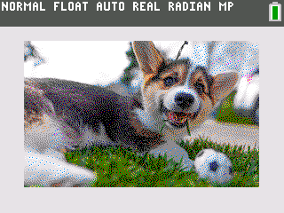

# Standard-Definition Picture Viewer Converter

Take advantage of the full TI-84 Plus CE graph screen! This Windows program generates code to draw any PNG picture. 
The generated code is pure TI-Basic so no jailbreaking is necessary.

*Photo of a puppy by Alex Glanville @Alex.takes.pics*

To display high resolution pictures that utilize the entire screen, use the High-Definition Picture Viewer: https://github.com/TheLastMillennial/HD-Picture-Viewer

### Instructions:
1. Drag and drop a PNG file onto SDPictureViewerConverter.exe
1. A file called program.txt should appear in the same directory as the PNG file.
    1. This should take less than 10 seconds. 
1. Copy the contents of program.txt to the program editor in TI-Connect CE.
1. (optional) save the program to your computer.
1. Ensure you have at least 90,000 bytes of free RAM.
1. Send the file to your calculator.
1. Run the program on your calculator.
1. The picture will render in about 25 minutes. 
    1. Note: Calculators made before 2019 will take over 30 minutes.
1. (optional) Screenshot the picture for instant use later.
    1. Press 2nd 
	1. Press 0
	1. Press 4
	1. Scroll up to StorePic
	1. Press enter
	1. You should see StorePic on your home screen
	1. Enter any number from 0-9 e.g. StorePic 2
	1. Press enter
1. (optional) Recall the screenshot
    1. Press 2nd 
	1. Press 0
	1. Press *
	1. Scroll down to RecallPic
	1. Press enter
	1. You should see RecallPic on your home screen
	1. Press vars
	1. Press 4
	1. Select the picture to recall
	1. Press enter
	1. You should see RecallPic Pic2 on your home screen
	1. Press enter